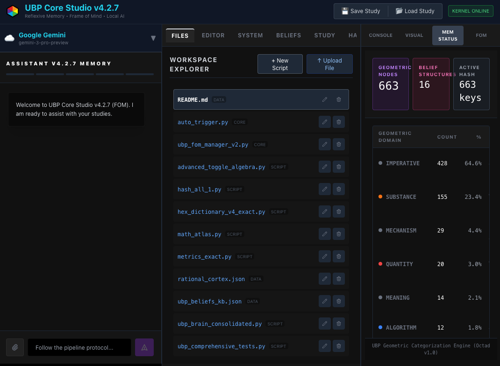

# UBP Core Studio

**UBP Core Studio** is a specialized research environment designed for exploring the **Universal Binary Principle (UBP)**. It integrates a local Python kernel (Pyodide), advanced AI assistance (Gemini + Local LLMs), and a reflexive memory system to create a powerful, self-contained workspace for computational philosophy and scientific discovery.

## Key Features

### Hybrid AI Architecture
*   **Google Gemini Integration**: Leverages state-of-the-art Gemini models (e.g., `gemini-3-pro`) for high-level reasoning, complex study planning, and multi-modal analysis.
*   **Local LLM Support**: Seamlessly connects to locally running models via **Ollama**, **LM Studio**, or **GPT4All**. This allows for privacy-focused, offline, or uncensored inference running directly on your machine.
*   **Frame of Mind (FOM)**: A unique cognitive bias management system. Switch the AI's analytical lens (e.g., from *"Scientific Strict"* to *"Creative Abstract"*) to suit different phases of research.

### Computational Workspace
*   **In-Browser Python Kernel**: Executes Python code directly in the browser using **Pyodide**. No backend server is required—computation happens locally on your device.
*   **Virtual File System**: Create, edit, and manage Python scripts (`.py`), data files (`.json`, `.md`), and logs within a persistent virtual workspace.
*   **Integrated Code Editor**: A full-featured editor for writing and debugging research scripts.
*   **Persistent Workspace:**: use the "Save Study/Load Study" to save your entire workspace including chat and scripts. The **kb files are not saved** with this but you can copy and save the content locally, reloading when needed.

### Visualization
*   **2D Plotting**: Generate scientific plots and charts using Python's `matplotlib`.
*   **3D Rendering**: Create and interact with complex 3D geometric structures using the built-in **Three.js** viewer. Perfect for visualizing UBP geometric domains.

### Reflexive Memory System
The studio maintains persistent knowledge bases that evolve with your research:
*   **System KB**: Core definitions, axioms, and immutable laws of UBP.
*   **Beliefs KB**: Working hypotheses, established understandings, and evolving theories.
*   **Study KB**: Long-form research notes, observations, and experimental results.
*   **Hash Memory**: Short-term transactional memory for fast retrieval and context management.

### Automatic File Download
The studio automatically downloads scripts from the UBP GitHub repository
*   **Workspace Python Scripts**: [https://github.com/DigitalEuan/UBP_Repo/tree/main/core_studio_v4.0/core]
*   **System KB**: [https://github.com/DigitalEuan/UBP_Repo/tree/main/core_studio_v4.0/system_kb]

### Experimental nature
*   **Development**: I am currently developing the scripts and kb files within the app so expect changes and all sort of experiments there.

---

## Getting Started

### Web Version (No Installation)
Simply access the deployed application URL. The entire environment runs within your web browser: [https://ai.studio/apps/8eef816d-e338-4bcb-9ae0-b9d2d0c476a5]

### Local AI Setup (Optional)
To use the **Local AI** features, you need a local inference server running.
1.  **Ollama**: Run `ollama serve` (Default port: 11434).
2.  **LM Studio**: Start the local server (Default port: 1234).
3.  **GPT4All**: Enable the API server (Default port: 4891).

Select your provider in the **Assistant** tab of the application.

---

## Usage Guide

### 1. The Workspace
The center panel is your lab bench. Use it to write Python scripts that test UBP concepts.
*   **Run Code**: Click `▶ Run` to execute the current script.
*   **File Management**: Create new scripts, upload data, or download your work using the file explorer.

### 2. The Assistant
Chat with the AI to plan experiments or analyze results.
*   **Context Aware**: The AI can read your currently open files and memory KBs.
*   **Tools**: It can write code for you, search the web (via Gemini), or propose updates to the Knowledge Base.

### 3. Frame of Mind (FOM)
Navigate to the **FOM** tab to see the active cognitive frame.
*   **Switch Frames**: Change the AI's "personality" and weighting logic to approach problems from different angles (e.g., *Mathematical* vs. *Semantic*).

### 4. Memory Status
Check the **Mem Status** tab to see what the AI currently "knows." This displays the raw JSON/Markdown content of the System, Beliefs, and Hash memories.

---

## Security & Privacy
*   **Client-Side Execution**: Python code runs entirely in your browser's sandbox. It does not execute on a remote server.
*   **API Security**: Gemini API keys are handled securely via environment injection and are never hardcoded into the client bundle.
*   **Local Data**: When using Local LLMs, your prompts and data never
*   **Made with Google AI Studio**: you can check the entire code and ask the Gemini AI if the APP is safe to use - or change it to however you like, the Studio can run any python scripts so you can remove all the UBP scripts and kb files, strip out the UBP logic from the APP itself and use it for you own system

# Made with

